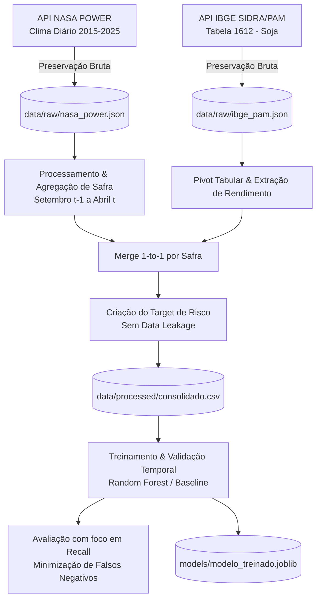

# Previsão de Risco de Baixa Produtividade Agrícola

[](https://www.python.org/)
[](https://pandas.pydata.org/)
[](https://scikit-learn.org/)
[](https://power.larc.nasa.gov/)
[](https://servicodados.ibge.gov.br/)

Projeto de Ciência de Dados e Inteligência Artificial voltado à previsão e alerta antecipado de **risco de baixa produtividade agrícola (quebra de safra)** para a cultura de **Soja em Grão** no município de **Piracicaba - SP** (safras 2015 a 2025).

---

##  1. Visão Geral do Problema de Negócio

As variações agroclimáticas (anomalias de precipitação, estresse térmico, déficit de umidade no solo) são os principais fatores de risco para a produtividade da lavoura de soja. 

* **Objetivo:** Construir um modelo preditivo capaz de sinalizar com antecedência se a safra agrícola terá rendimento abaixo do padrão histórico esperado.
* **Recorte Geográfico:** Piracicaba - SP (Código IBGE: `3538709` | Lat: `-22.7253`, Lon: `-47.6492`).
* **Recorte Temporal:** Safras de 2015 a 2025.
* **Unidade de Análise:** Ano-safra de soja (janela de desenvolvimento da cultura: Setembro do ano anterior a Abril/Agosto do ano de colheita).
* **Custo do Erro (Falso Negativo vs Falso Positivo):** 
  * O **Falso Negativo** (o modelo prevê safra normal, mas ocorre quebra) impede que o produtor rural e instituições financeiras/seguradoras adotem medidas de mitigação preventiva (irrigação complementar, ajuste no manejo de insumos, contratação de seguro agrícola, trava de preços).
  * Portanto, a métrica prioritária de avaliação do projeto é o **Recall (Sensibilidade)** da classe positiva (*Risco de Baixa Produtividade*).

---

##  2. Formulação de Machine Learning & Anti-Leakage

Para garantir a validade preditiva em ambiente real de produção:

1. **Prevenção de Vazamento de Dados (Data Leakage):**
   * As variáveis da Pesquisa Agrícola Municipal - PAM (Área colhida, Quantidade produzida, Rendimento médio) só são publicadas **após** o encerramento da safra. Por isso, são utilizadas **exclusivamente para a formulação da variável-alvo (Target / Ground Truth)**.
   * As **Features Preditivas ($X$)** utilizam estritamente indicadores meteorológicos agregados obtidos durante o período de desenvolvimento da cultura (NASA POWER).
2. **Definição da Variável Alvo ($y$):**
   * Classificação Binária: `risco_baixa_produtividade` ($1 = \text{Risco Alto / Rendimento } \le \text{Limiar Histórico}$; $0 = \text{Produtividade Normal/Alta}$).
3. **Estratégia de Validação:**
   * Validação temporal estrita (*Walk-Forward / Time-Series Split / Leave-One-Year-Out*) para respeitar a causalidade temporal e evitar contaminação do passado pelo futuro.

---

##  3. Fontes de Dados e APIs

| Fonte | API / Endpoint | Resolução | Variáveis Utilizadas |
| :--- | :--- | :--- | :--- |
| **NASA POWER** | [Daily Point API](https://power.larc.nasa.gov/api/temporal/daily/point) | Diária | `PRECTOTCORR` (Precipitação mm), `T2M` (Temp. Média °C), `T2M_MAX`, `T2M_MIN`, `RH2M` (Umidade Relativa %), `GWETROOT` (Umidade do Solo na Raiz) |
| **IBGE (PAM)** | [Agregado 1612 - Lavouras Temporárias](https://servicodados.ibge.gov.br/api/v3/agregados/1612) | Anual (Safra) | *Rendimento médio da produção (kg/ha)*, *Área plantada (ha)*, *Área colhida (ha)*, *Quantidade produzida (t)* |

---

##  4. Estrutura do Repositório

O projeto segue a estrutura padrão de engenharia de software e ciência de dados (*Cookiecutter Data Science*):

```text
bx_produtividade_agricola/
├── .gitignore                      # Regras de exclusão do Git (ignora caches, envs e temporários)
├── README.md                       # Documentação completa do projeto
├── requirements.txt                # Dependências e bibliotecas do projeto
│
├── data/                           # Armazenamento e ciclo de vida dos dados
│   ├── raw/                        # Dados brutos imutáveis salvos das APIs (JSON)
│   │   ├── ibge_pam_Piracicaba_SP_2015_2025.json
│   │   └── nasa_power_Piracicaba_SP_2015_2025.json
│   ├── interim/                    # Dados intermediários de transformações
│   └── processed/                  # Datasets consolidados e prontos para treino (CSV)
│       └── safras_soja_piracicaba_consolidado.csv
│
├── notebooks/                      # Jupyter Notebooks organizados sequencialmente
│   └── 01_coleta_de_dados.ipynb    # Ingestão, exploração inicial e validação de qualidade
│
├── src/                            # Código-fonte Python modularizado e reutilizável
│   ├── __init__.py
│   ├── config.py                   # Parâmetros centrais (coordenadas, anos, endpoints, features)
│   ├── data/                       # Módulos de extração e ingestão de APIs
│   │   ├── __init__.py
│   │   ├── coleta_nasa.py          # Coleta e persistência NASA POWER
│   │   ├── coleta_ibge.py          # Coleta e metadados IBGE PAM 1612
│   │   └── pipeline_coleta.py      # Orquestrador CLI de coleta
│   ├── features/                   # Processamento e agregação de safras
│   │   ├── __init__.py
│   │   └── processamento.py        # Agregação set-abr, merge e geração do target anti-leakage
│   ├── models/                     # Treinamento, validação e inferência de IA
│   │   ├── __init__.py
│   │   ├── train.py                # Pipeline de treino do modelo preditivo
│   │   └── evaluate.py             # Métricas de avaliação com foco em Recall
│   └── utils/                      # Funções utilitárias (I/O, logs)
│       ├── __init__.py
│       └── helpers.py
│
├── models/                         # Modelos treinados serializados (.joblib / .pkl)
│
└── docs/                           # Documentação técnica e materiais das aulas/trilhas
    ├── guia_investigacao_apis.ipynb
    ├── investigacao_fontes_dados_trilhaC.xlsx
    └── cd_aula/                    # Referências e roteiros de apoio
```

---

##  5. Como Instalar e Executar

### 5.1. Pré-requisitos
* Python 3.10 ou superior
* Gerenciador de pacotes `pip` ou `conda`

### 5.2. Configuração do Ambiente Virtual

```bash
# 1. Clone o repositório (se aplicável)
git clone https://github.com/SAMUKISZHSD/bx_produtividade_agricola.git
cd bx_produtividade_agricola

# 2. Crie e ative um ambiente virtual
python3 -m venv .venv
source .venv/bin/activate  # No Linux/macOS
# .venv\Scripts\activate   # No Windows

# 3. Instale as dependências
pip install -r requirements.txt
```

### 5.3. Executando os Pipelines Modulares via Terminal (`src/`)

Você pode rodar qualquer etapa do fluxo diretamente pelos módulos Python:

```bash
# 1. Coleta e salvamento dos dados brutos das APIs (NASA + IBGE PAM):
python -m src.data.pipeline_coleta

# 2. Processamento, agregação climática por safra e geração do target:
python -m src.features.processamento

# 3. Treinamento e avaliação do modelo de Machine Learning:
python -m src.models.train
```

### 5.4. Executando via Jupyter Notebooks

Para análise interativa e visualização de gráficos:

```bash
jupyter notebook notebooks/01_coleta_de_dados.ipynb
```

---

## 6. Pipeline de Dados & Arquitetura




---

## 👥 Equipe do Projeto

Jean Carlos
João Guilherme
Samuel Alan
